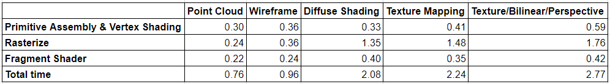
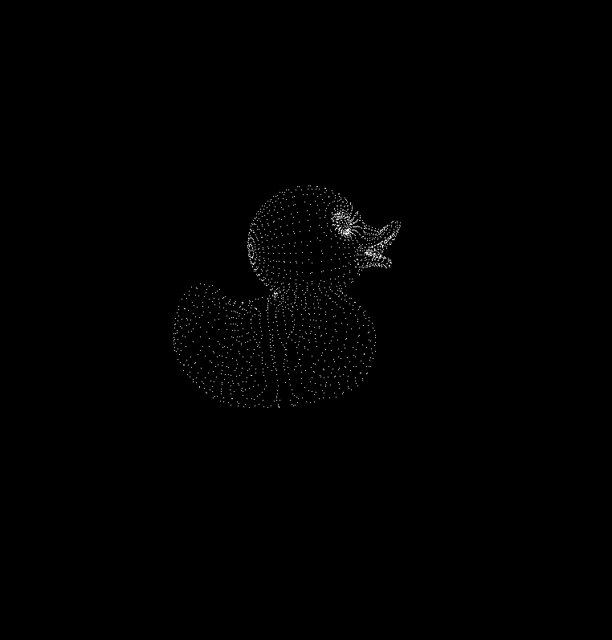

CUDA Rasterizer
===============

**University of Pennsylvania, CIS 565: GPU Programming and Architecture, Project 4**

* Mohamed Soudy
* Tested on: Windows 10 Pro, i7-7700HQ @ 2.80GHz 16GB, GTX 1080 with Max-Q Design 8GB (Personal Computer)

## Overview

An implementation of a simplified rasterized graphics pipeline on CUDA. 
Features include triangle, line and point primitive rasterization 
and UV texture mapping with bilinear texture filtering and perspective correct texture coordinates.

## Analysis

### Pipeline Stages Analysis

The following tables and their corresponding charts show the time spent in each pipeline stage for the duck and Cesium truck model
tested with features turned on/off.

In all scenarios, the rasterize stage took the longest time, especially when UV texture mapping is activated 
with bilinear texture filtering and perspective correct texture coordinates which dramatically impact performance. In fact,
it becomes 3 times slower than rasterizing the model as a point cloud as can be seen in the duck model below. 

The performance hit is much worse when the bounding box of the model is much larger as can be seen in the truck chart below.
This is because we're iterating over more pixels in the Cesium truck model than in the duck model.  

### Perspective Correct

Below are images showing the results of the rasterizer with and without perspective correct texture coordinates.
The first image has texture artifacts on the model because we're not considering the depth information.
The second image shows the correct result after using perspective correct texture coordinates.

### Points & Lines Rasterization

The following images show the results of rasterizing the duck model as points and lines (wireframe) respectively.
This of course dramatically improved the performance of the rasterize stage (see charts above).

## Credits

* [tinygltfloader](https://github.com/syoyo/tinygltfloader) by [@soyoyo](https://github.com/syoyo)
* [glTF Sample Models](https://github.com/KhronosGroup/glTF/blob/master/sampleModels/README.md)
